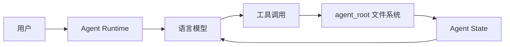

# FileSystem-based Agent 架构设计

## 核心理念：Runtime + State 分离

本项目采用完全解耦的架构设计，将 Agent 系统分为两个独立部分：

### 1. Agent Runtime（运行时）

Runtime 是一个纯粹的工具提供者，它：
- **不保存状态**：每次运行都是无状态的
- **不关心业务**：不知道 Agent 在做什么具体任务
- **只提供能力**：文件操作、命令执行、日志记录

#### Runtime 组件

```
src/
├── file_system_agent.py    # 核心 Agent 类，提供工具接口
├── async_agent.py          # 异步运行时，处理 LLM 交互
├── tools.py                # 基础工具实现
├── file_editor.py          # 文件编辑工具
├── stateful_shell.py       # 持久化 Shell 会话
├── persistent_shell.py     # 基于 pexpect 的 Shell 实现
├── path_manager.py         # 路径管理，确保安全
├── logger.py               # 操作日志记录
└── config.py               # 配置管理
```

### 2. Agent State（状态）

所有 Agent 的状态都保存在 `agent_root` 目录下：

```
agent_root/
├── context_window_main.md  # 当前工作记忆（热数据）
├── guideline.md            # Agent 行为准则
├── workspace/              # 工作区（当前项目文件）
└── storage/                # 持久化存储
    ├── documents/          # 参考文档和知识库
    ├── few_shots/          # 代码示例
    └── history/            # 历史任务归档
```

## 设计优势

### 1. 完全可迁移

- 整个 `agent_root` 目录可以打包迁移到任何地方
- Agent 的所有知识、记忆、工作都在这个目录中
- 换一个 Runtime 环境也能继续工作

### 2. 版本控制友好

- `agent_root` 可以用 git 管理
- 每个任务的历史都有清晰的文件记录
- 可以回滚到任意历史状态

### 3. 调试透明

- 所有操作都有日志
- 状态变化都体现在文件系统中
- 可以直接查看和修改 Agent 的"思维"

### 4. 多 Agent 协作

- 不同 Agent 可以有不同的 `agent_root`
- Agent 之间可以通过文件系统共享信息
- 支持并行运行多个 Agent

## 工作流程



1. **用户输入**：用户向 Runtime 发送任务
2. **LLM 处理**：Runtime 将任务和当前状态发送给 LLM
3. **工具调用**：LLM 决定使用哪些工具
4. **状态更新**：工具操作更新 `agent_root` 中的文件
5. **记忆同步**：通过 `sync_context` 更新工作记忆

## 关键机制

### sync_context 机制

这是连接 Runtime 和 State 的关键：

1. **Agent 自主管理**：Agent 自己决定保留什么信息
2. **冷热分离**：重要信息保留在 context，历史归档到 storage
3. **避免递归**：解决了"更新记忆需要记忆"的问题

### 持久化 Shell

通过 pexpect 实现真正的 Shell 会话：

1. **状态保持**：cd、环境变量、别名都能持久
2. **复杂命令**：支持管道、重定向、复合命令
3. **交互处理**：自动检测并处理交互式命令

## 扩展性

### 添加新工具

在 `tools_registry.py` 中注册新工具：

```python
{
    "name": "new_tool",
    "description": "工具描述",
    "input_schema": {...}
}
```

### 支持新的 LLM

修改 `async_agent.py` 中的 LLM 客户端即可。

### 自定义存储结构

在 `guideline.md` 中指导 Agent 如何组织文件。

## 最佳实践

1. **明确的任务定义**：在 context 中清晰记录当前任务
2. **充分的参考资料**：将相关文档放入 storage/documents
3. **定期归档**：完成的任务及时归档到 history
4. **保持 context 精简**：只保留当前任务必需的信息

## 未来展望

1. **多模态支持**：处理图片、音频等文件
2. **分布式协作**：多个 Agent 共同完成任务
3. **智能索引**：自动构建知识图谱
4. **增量学习**：从历史任务中学习经验